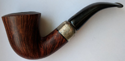

### / [shell-scripts](../) / [md-alb-gen](.)

-----------------------------------------------------------------------------------

# Include all images from all directories below in the format of Markdown

## Example

#### 1/2/3/apply canvas


#### 1/2/3/rippling


#### 1/orig 250x


## Usage
1. Save the script into `md-alb-gen.sh` file.
2. Make the script globally available
```
sudo cp md-alb-gen.sh /usr/local/bin/md-alb-gen
sudo chmod a+x /usr/local/bin/md-alb-gen
```
3. Go in the command line to the required directory.
4. Execute the script with `md-alb-gen`
5. The file structure will stored inside a index.md or List.md file.
