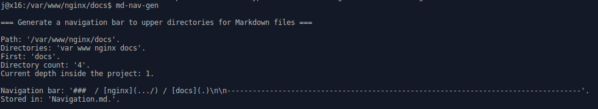

### / [shell-scripts](../) / [md-nav-gen](.)

-----------------------------------------------------------------------------------

# Generate a navigation bar for Markdown as this one above

## Why should I need it?

I created it for my own GitHub Pages because by default they don't have nav. bar.
I find it rather uncomfortable to navigate the site by clicking the 'Back' button
or editing the URL.

This can be useful not only in Github Pages but in any other MarkDown viewer.

## Working example
[How to improve NGINX security?](https://janis-rullis.github.io/nginx/docs/how-to-improve-security.html).


### Do you want something more for your Github Pages?
You can fully control the whole page look just like Bootstrap or Jekyll did it by
customizing it in the `gh-pages` branch. See more info in [janis-rullis/github-pages](https://github.com/janis-rullis/github-pages).

## Usage
1. Save the script into `md-nav-gen.sh` file.
2. Make the script globally available
```
sudo cp md-nav-gen.sh /usr/local/bin/md-nav-gen
sudo chmod a+x /usr/local/bin/md-nav-gen
```
3. Go in the command line to the required directory.
4. Execute the script with `md-nav-gen`
5. A Navigation.md file with the navigation bar will be created.


